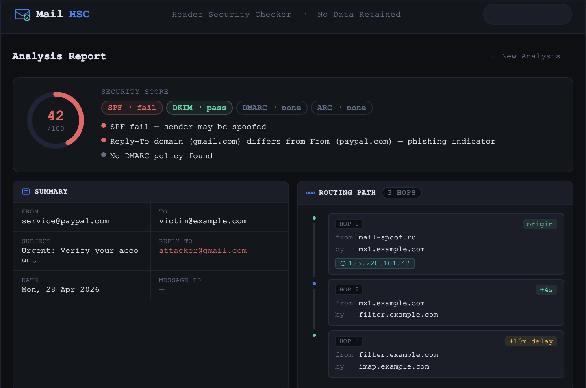

# 🔍 MailHSC - Header Security Checker

[](https://www.gnu.org/licenses/agpl-3.0)
[](https://golang.org)
[](https://traefik.io)
[](https://docker.com)



> **Rip apart email headers in seconds.** SPF, DKIM, DMARC, ARC, hop-by-hop routing, phishing indicators — all in a clean dark UI. Zero data retained. Ever.
> RFC 9989 / 9990 / 9991 (DMARCbis, May 2026) compatible.

---

## ✨ Features

| | |
|---|---|
| 📋 | Paste raw headers **or** upload a `.eml` file |
| 🛤️ | Hop-by-hop routing visualization with delay indicators |
| 🔐 | SPF / DKIM / DMARC / ARC / NP extraction & scoring — RFC 9989 (DMARCbis) ready |
| 🎯 | Security score (0–100) with actionable breakdown |
| 🎣 | Reply-To ≠ From domain detection (phishing indicator) |
| 🌍 | Auto language detection — 🇬🇧 🇫🇷 🇩🇪 🇪🇸 |
| 🧠 | Everything processed in memory — GC'd after response |
| 🔒 | Fonts served locally — fully GDPR compliant |
| ⚡ | Rate limiting per IP on the analysis endpoint |
| 🚀 | HTTPS via Traefik — self-signed locally, Let's Encrypt in production |

---

## 🚀 Quick Start

```bash
git clone https://github.com/boscorelly/mailhsc.git
cd mailhsc
make up
```

`make up` runs `start.sh` which reads `DEPLOY_MODE` from `.env` and starts the right stack:

| `DEPLOY_MODE` | URL | TLS | Use case |
|---|---|---|---|
| `standalone` *(default)* | http://localhost:8080 | None | Local dev, behind existing proxy |
| `full` | https://yourdomain.com | Let's Encrypt auto | Production |

| Command | Description |
|---|---|
| `make up` | Start (creates `.env` if missing) |
| `make down` | Stop all containers |
| `make update` | Stop, rebuild without cache, restart |
| `make logs` | Follow logs |
| `make build` | Build image only |
| `make clean` | Remove dangling containers and untagged images |

> Always use `make up` / `make update` — never `docker compose up -d` directly.

---

## ⚙️ Configuration

Everything lives in `.env` (auto-created from `.env.example` on first `make up`).

### Standalone — default, no config needed

```env
DEPLOY_MODE=standalone
STANDALONE_PORT=8080    # port exposed on the host
```

Starts a single container on `http://localhost:8080`. No TLS, no Traefik.
Ideal for local dev or placement behind an existing reverse proxy (Nginx, Caddy…).

### Full — production with automatic HTTPS

```env
DEPLOY_MODE=full
DOMAIN=mail.yourdomain.com
TRAEFIK_ACME_EMAIL=admin@yourdomain.com
ACME_RESOLVER=letsencrypt-tls        # TLS-ALPN-01, port 443 must be reachable
```

### Full — behind NAT or wildcard certificate

```env
DEPLOY_MODE=full
DOMAIN=mail.yourdomain.com
TRAEFIK_ACME_EMAIL=admin@yourdomain.com
ACME_RESOLVER=letsencrypt-dns
TRAEFIK_DNS_PROVIDER=ovh
OVH_ENDPOINT=ovh-eu
OVH_APPLICATION_KEY=xxx
OVH_APPLICATION_SECRET=xxx
OVH_CONSUMER_KEY=xxx
```

> **Supported DNS providers:** OVH · Cloudflare · Gandi · Scaleway · Route53 · DigitalOcean · Namecheap
> See `.env.example` for all providers and their required variables.

---

## 🧮 Security Score

The score starts at **100** and points are deducted for each issue detected:

| Condition | Deduction |
|---|---|
| SPF fail / softfail | −25 |
| SPF missing | −15 |
| SPF unknown result | −5 |
| DKIM fail | −25 |
| DKIM missing | −10 |
| DKIM present but unverified | −5 |
| DMARC fail | −20 |
| DMARC missing | −5 |
| ARC fail | −10 |
| NP fail (RFC 9989 subdomain policy) | −10 |
| Reply-To domain ≠ From domain | −20 |
| Reply-To ≠ From (same domain) | −5 |
| X-Spam-Flag: YES | −20 |

The score is floored at **0** (cannot go negative).

> **RFC 9989 / DMARCbis (May 2026):** The `np=` tag (non-existent subdomain policy) is parsed from `Authentication-Results` when present. Result values are matched up to 32 characters to handle any future `bestguesspass`-style values. Existing `v=DMARC1` records remain fully valid — no changes needed.

**ARC** (`none`) is neutral — the protocol is optional and not yet widely deployed.  
**Hop delays** > 1 hour are flagged as informational but do not affect the score.

| Score | Interpretation |
|---|---|
| 80–100 | ✅ Healthy |
| 45–79 | ⚠️ Issues to investigate |
| 0–44 | 🚨 High risk |

---

## 🏗️ Architecture

```
                    ┌─────────────────────────────────────┐
  Internet  ──────► │  Traefik :443/:80                   │
                    │  HTTPS · rate limit · sec headers    │
                    └──────────────┬──────────────────────┘
                                   │ internal network
                    ┌──────────────▼──────────────────────┐
                    │  Go app :8080                        │
                    │  parse in memory · no internet       │
                    └──────────────┬──────────────────────┘
                                   │
                              JSON response
                           (nothing retained)
```

---

## 🛡️ Security

| Measure | Detail |
|---|---|
| 📦 Distroless image | No shell, no package manager in final image |
| 👤 Non-root user | UID 65532 (`distroless:nonroot`) |
| 🔒 Read-only filesystem | `read_only: true` |
| ⚔️ No Linux capabilities | `cap_drop: ALL` — Traefik adds only `NET_BIND_SERVICE` |
| 🌐 Isolated network | App container has zero internet access |
| 📏 Body size limit | 5 MB in Go + 6 MB in Traefik |
| 🧱 Security headers | CSP · HSTS · X-Frame-Options · Referrer-Policy |
| 🔐 TLS 1.2+ only | Enforced in `traefik/dynamic.yml` |
| 🚦 Rate limiting | 10 req/s burst 20 on `/api/analyze`, keyed per source IP |
| 🤐 No data logging | Go never logs request bodies or header content |
| 🔤 Local fonts | Zero requests to Google Fonts or any third party |
| 🗝️ Secrets in `.env` | Never hardcoded in `docker-compose.yml` |

### 📌 Image pinning (supply chain)

```bash
./scripts/pin-images.sh   # prints SHA256 digests — pin them in compose + Dockerfile
```

---

## 📄 License

**GNU Affero General Public License v3.0** — see [LICENSE](LICENSE).

If you run a modified version of MailHSC over a network, you must make the complete source code available to the users of that service (AGPL §13).
